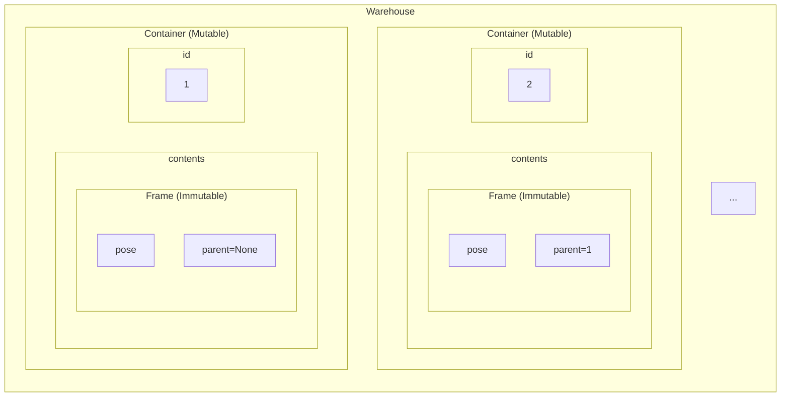
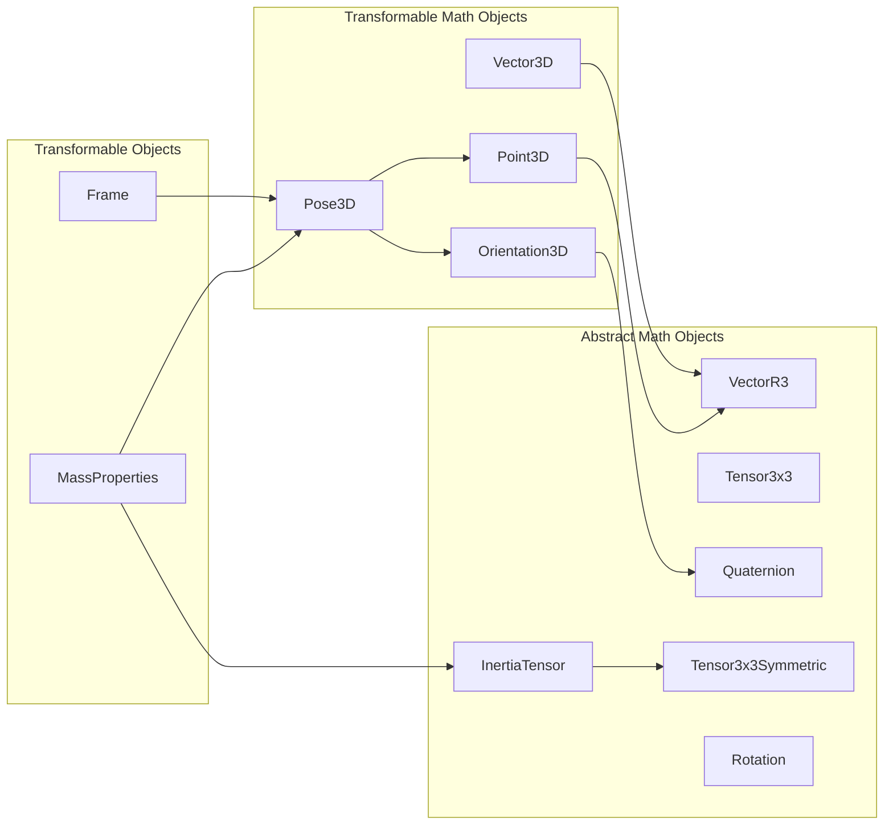
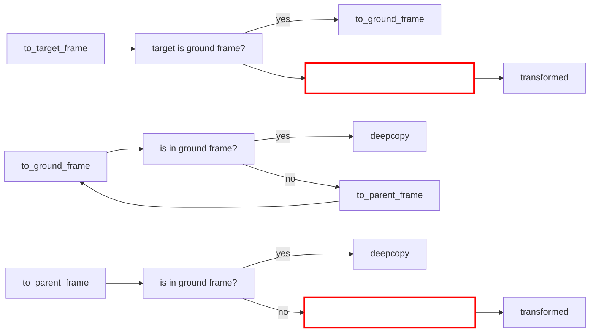

# Welcome to DGin

Eventually, this will be a dynamics engine.

## Purpose

Simulate 6DOF rigid body dynamics

## Requirements

- Store data in a serializable/deserializable format
- Syntax that is easy to read
- Work with Python type-hinting

## Description

Immutable contents are stowed into mutable Containers in a Warehouse.  The mutable Containers are recalled from a dictionary by ID.  Objects needing to cross-reference one another should Reference the container ID of the other object and unpack the object when needed.  This way the whole warehouse can serialize/deserialize.



## Structure

### Composition

Pydantic makes it easy to nest models through composition.  This creates a nested json schema.  See online discussions of benefits of composition over inheritance ("has a" versus "is a").  The following diagram shows how composition is used to build the objects we need for defining and transforming mass properties.



### Transformation

The transformations are performed recursively (as necessary) by transforming the components of `Transformable` objects. The transformation function calls look like this:



The user must provide the two component transformation functions: `get_components_in_parent_frame` and `get_components_in_target_frame`.  

!!! tip "Avoid Infinite Recursion"
    
    - For objects in the `Frame` class composition tree, the  `get_components_in_target_frame` transformation function can use the frame's recursive `to_ground_frame` method but not the frames `to_target_frame` method.
    - For objects outside of the `Frame` class composition tree, you can directly use the frame's `to_target_frame` method.  See the `MassProperties` transformation for example.

## Examples

```python

```